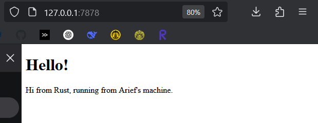

# advprog-modul6

### Commit 1 Reflection Notes
Function `handle_connection` memproses koneksi TCP yang datang, membaca HTTP request per line, dan mem-printnya.

Keyword `mut` menyatakan bahwa stream tersebut mutable. Artinya, function dapat mengubah stream.

`buf_reader` melakukan banyak read tetapi tidak sering sehingga mengurangi system call, dibanding menggunakan `read` yang menggunakan system call tiap kali dipanggil.

Lalu, function akan membaca HTTP request per line dan memprintnya menggunakan format pretty print untuk debugging yaitu `{:#?}`.

### Commit 2 Reflection Notes

Berbeda dengan sebelumnya, handle_connection kali ini tidak mem-print request, tapi mengirimkan response ke client dalam bentuk html.

Function akan membaca file `hello.html` dan membacanya ke dalam String. Lalu, function akan membuat HTTP response dan mengirimkannya ke client. Hasil dari response tersebut dapat dilihat pada gambar di atas.